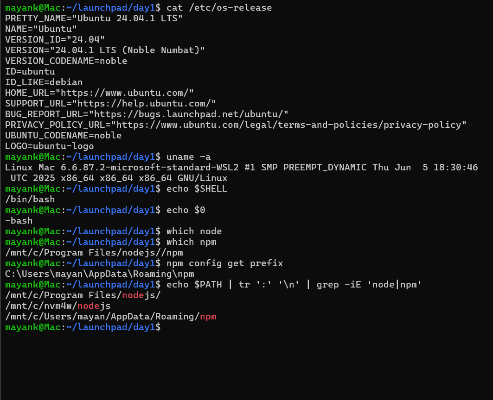
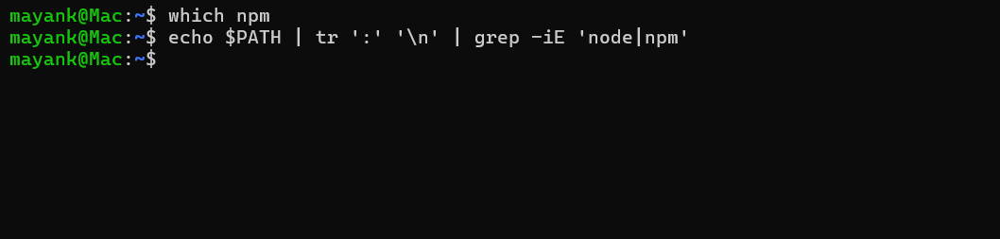

# System Report - Day 1, Task 1

## Environment
- Host OS: Windows 11
- Working environment: WSL2 (Ubuntu 24.04.1 LTS "Noble Numbat")
- Kernel: Linux 6.6.87.2-microsoft-standard-WSL2
- Architecture: x86_64

## Shell
- Default shell: /bin/bash
- Active shell process: -bash (login shell)

## Commands & Output - Initial Inspection

### OS version
```bash
$ cat /etc/os-release
PRETTY_NAME="Ubuntu 24.04.1 LTS"
NAME="Ubuntu"
VERSION_ID="24.04"
VERSION="24.04.1 LTS (Noble Numbat)"
VERSION_CODENAME=noble
ID=ubuntu
ID_LIKE=debian

$ uname -a
Linux Mac 6.6.87.2-microsoft-standard-WSL2 #1 SMP PREEMPT_DYNAMIC Thu Jun  5 18:30:46 UTC 2025 x86_64 x86_64 x86_64 GNU/Linux
```

### Shell
```bash
$ echo $SHELL
/bin/bash

$ echo $0
-bash
```

### Node binary path
```bash
$ which node
(empty  - not found)

$ node -v 
Command 'node' not found, but can be installed with:
sudo apt install nodejs
```

### NPM global install path
```bash
$ which npm
/mnt/c/Program Files/nodejs//npm

$ npm config get prefix
C:\Users\mayan\AppData\Roaming\npm
```

### PATH entries containing node/npm
```bash
$ echo $PATH | tr ':' '\n' | grep -iE 'node|npm'
/mnt/c/Program Files/nodejs/
/mnt/c/nvm4w/nodejs
/mnt/c/Users/mayan/AppData/Roaming/npm
```


## Key Finding: Windows PATH Interlop Leakage
WSL2 by default appends the Windows PATH to the Linux PATH. This caused 'npm' to silently resolve to the Windows-native npm install instead of failing cleanly or using a Linux-native binary. This is a common but subtle WSL gotcha - mixing Windows-native and Linux-native Node tooling can cause issues with native modules, file path handling, and line endings.

## Fix Applied
Disabled Windows PATH interop by adding to '/etc/wsl.conf':
 [interop]
 appendWindowsPath = false

Restarted WSL via 'wsl --shutdown' (from powershell) and reopened the terminal.

## Commands & Output — Verification (after fix)
```bash
$ echo $PATH | tr ':' '\n' | grep -iE 'node|npm'
(empty)

$ which node
(empty)

$ which npm
(empty)
```




## Conclusion
WSL shell is now fully isolated from WWindows-native Node/npm. Next step is
to install Node natively inside WSL via NVM, so all tooling for this
bootcamp runs on Linux-native binaries with no dependency on Windows
interop.

#END---------------------------------------------------
